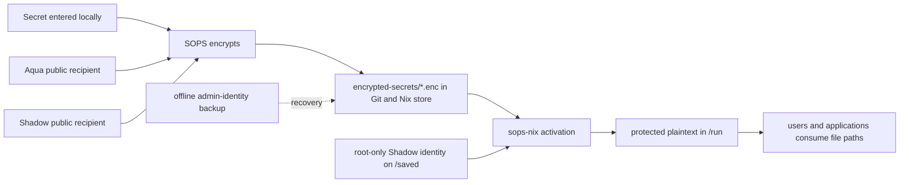

# Secret management on Shadow

This repository uses [SOPS](https://getsops.io/),
[age](https://age-encryption.org/), and
[sops-nix](https://github.com/Mic92/sops-nix) to keep credentials out of Git
plaintext and out of the Nix store while still deploying them declaratively.

This document describes the implementation on the `shadow` host. It is both an
operator runbook and an explanation of the security model.

## The three components

### age: identities and recipients

[age](https://github.com/FiloSottile/age) provides the public-key encryption
identities used by SOPS.

- An age **recipient** starts with `age1...`. It is public and acts like a
  padlock. Recipients are safe to place in `.sops.yaml` and Git.
- An age **identity** contains private key material, normally beginning with
  `AGE-SECRET-KEY-1...`. It opens the corresponding recipient and must never be
  committed, pasted into chat, or stored in an unencrypted backup.

Shadow uses two independent identities. Both public recipients encrypt each
SOPS data key, so **either private identity can decrypt**. This is recovery
redundancy, not two-factor or two-of-two encryption.

### SOPS: encrypted files that remain versionable

[SOPS](https://github.com/getsops/sops) is the encrypted-file editor. For each
file it generates a random data-encryption key, encrypts the data, and wraps the
data key once for every age recipient selected by `.sops.yaml`. SOPS also stores
integrity metadata so unauthorized changes are detected during decryption.

The files in this repository use SOPS `binary` format. The whole original
value or file is encrypted as one `data` field inside a JSON envelope. Git can
therefore track changes to ciphertext, while plaintext never needs to exist in
the working tree.

Ciphertext does not hide all metadata. An observer can still see:

- The encrypted file name.
- Its approximate size and modification history.
- The public recipients authorized to decrypt it.
- SOPS version and cryptographic metadata.

The original content is encrypted.

### sops-nix: activation-time deployment

[sops-nix](https://github.com/Mic92/sops-nix) is the NixOS integration. It
copies committed ciphertext through the Nix store, decrypts it during system
activation, assigns declarative ownership and modes, and atomically exposes
runtime files under `/run`.

No Nix expression reads a plaintext credential. This distinction matters:
ordinary Nix strings and `builtins.readFile` results can be copied into the
world-readable Nix store. sops-nix templates use opaque placeholders during
evaluation and substitute plaintext only during activation.

## End-to-end flow



The normal deployment path uses Shadow's identity. Aqua's identity exists for
editing, rotation, disaster recovery, and authorizing replacement hosts.

## Repository files: written versus generated

| Path                                     | Kind                                  | Created by               | Hand-edit?        | Commit? |
| ---------------------------------------- | ------------------------------------- | ------------------------ | ----------------- | ------- |
| `flake.nix`                              | Dependency and check policy           | Human                    | Yes               | Yes     |
| `flake.lock`                             | Exact dependency revisions/hashes     | `nix flake update`       | No                | Yes     |
| `.sops.yaml`                             | Public recipients and creation rules  | Human                    | Yes, carefully    | Yes     |
| `.gitleaks.toml`                         | Secret-scanner policy                 | Human                    | Yes               | Yes     |
| `modules/nixos/security/secrets.nix`     | Runtime secret declarations/templates | Human                    | Yes               | Yes     |
| `modules/nixos/core/users.nix`           | Password consumers and root lock      | Human                    | Yes               | Yes     |
| `modules/nixos/storage/preservation.nix` | Persistent-key mounts and modes       | Human                    | Yes               | Yes     |
| `modules/home/wm/noctalia/config.toml`   | Non-secret TOML template              | Human/application source | Yes               | Yes     |
| `encrypted-secrets/*.enc`                | SOPS ciphertext envelopes             | SOPS                     | Only through SOPS | Yes     |
| `/run/secrets*`                          | Runtime plaintext                     | sops-nix                 | No                | Never   |
| Private age identities                   | Decryption keys                       | `age-keygen`             | No                | Never   |

Generated ciphertext is expected to be mode `0644`: it is designed to be
shareable. Access control belongs on private identities and decrypted runtime
files, not on ciphertext.

## Key inventory and persistence

### Aqua admin identity

Runtime path:

```text
/home/aqua/.config/sops/age/keys.txt
```

Persistent backing path:

```text
/saved/home/aqua/.config/sops/age/keys.txt
```

Expected ownership and mode:

```text
aqua:users 0600
```

The home path is the standard location discovered by SOPS. Because `/` and
`/home` are tmpfs on this host, Preservation bind-mounts `.config/sops` from
`/saved`. Before the new Preservation generation is active, commands can use:

```console
SOPS_AGE_KEY_FILE=/saved/home/aqua/.config/sops/age/keys.txt sops ...
```

### Shadow deployment identity

Private identity:

```text
/saved/var/lib/sops-nix/key.txt
```

Public recipient copy:

```text
/saved/var/lib/sops-nix/recipient.txt
```

Expected metadata:

```text
/saved/var/lib/sops-nix               root:root 0700
/saved/var/lib/sops-nix/key.txt       root:root 0400
/saved/var/lib/sops-nix/recipient.txt root:root 0444
```

The private identity is directly on `/saved`, which Disko mounts persistently
and marks `neededForBoot`. It is not a Preservation bind mount. The sops-nix
option `generateKey = false` intentionally makes a missing key an error: a
silently generated replacement cannot decrypt existing ciphertext.

The `recipient.txt` file is public. Directory traversal remains root-only so
the private identity is not exposed merely because its sibling is public.

### Backup requirement

Back up at least Aqua's admin identity using an **independent** protection
mechanism, for example:

- A LUKS-encrypted offline USB drive.
- A KeePassXC attachment protected by a strong master password, with the
  database copied off-device.
- Another encrypted backup system whose recovery key is not stored only on
  this laptop.

A second copy on `/saved` is not a backup. Loss or corruption of the internal
disk would destroy both copies. Backing up the deployment identity as well is
useful but optional if the admin identity is safely recoverable.

Never encrypt the only backup of the admin identity to that same identity; that
creates a circular recovery dependency.

## Current encrypted inventory

### Deployed automatically

| Ciphertext                       | Runtime use                                                          |
| -------------------------------- | -------------------------------------------------------------------- |
| `aqua-password-hash.enc`         | Early user creation; Aqua's yescrypt password hash                   |
| `nix.conf.enc`                   | `/run/secrets/nix-config`, linked to Aqua's `~/.config/nix/nix.conf` |
| `noctalia-wallhaven-api-key.enc` | Injected into the rendered Noctalia TOML                             |

### Encrypted archive, not decrypted automatically

| Ciphertext                  | Reason                                                   |
| --------------------------- | -------------------------------------------------------- |
| `github-token.enc`          | No current module or service consumes it                 |
| `wireguard-shadow.conf.enc` | No current declarative WireGuard/NetworkManager consumer |

Keeping unused ciphertext undeclared follows least privilege: sops-nix does not
create runtime plaintext merely because an encrypted archive exists.

`/saved/secrets/Passwords.kdbx` is not migrated. A KeePass database is already
an encrypted, frequently modified application database; wrapping it in SOPS
would add awkward versioning without improving its unlocked-session security.
It still needs an off-device backup.

## Activation and boot ordering

The relevant boot/activation sequence is:

1. Disko unlocks the LUKS container and mounts `/saved` early.
2. sops-nix reads `/saved/var/lib/sops-nix/key.txt`.
3. `aqua-password-hash` has `neededForUsers = true`, so it is decrypted into
   `/run/secrets-for-users` before NixOS creates users.
4. NixOS applies `users.mutableUsers = false`:
   - Aqua's hash comes from the decrypted file.
   - Root's hash is `!`, locking direct password authentication.
   - `passwd` changes are not authoritative; password rotation must update the
     encrypted hash and activate a new generation.
5. Normal sops-nix activation decrypts `nix-config` and the Noctalia
   credential under `/run/secrets`.
6. sops-nix replaces template placeholders and writes
   `/run/secrets/rendered/noctalia-config.toml` as `aqua:users 0600`.
7. Home Manager creates out-of-store symlinks from Aqua's expected application
   paths to the runtime files.
8. Preservation mounts Aqua's admin identity and persistent application state.

`/run/secrets` and `/run/secrets-for-users` are tmpfs runtime state and must not
be preserved. sops-nix uses versioned directories and atomic symlink replacement
so readers do not observe partially written secrets.

## Noctalia template behavior

The tracked TOML contains non-secret markers:

```toml
api_key = "@WALLHAVEN_API_KEY@"
```

`modules/nixos/security/secrets.nix` reads only this non-secret template during
Nix evaluation. The sops-nix template replaces markers with opaque placeholders
at evaluation, then substitutes plaintext during activation.

The rendered TOML lives in tmpfs and is writable by Aqua. Durable configuration
changes must be made to the tracked template and activated again; edits made
only to the rendered `/run` file disappear at reboot or the next activation.

The Wallhaven key was previously committed to Git in plaintext and must be
rotated at the provider. Encrypting the old value does not revoke a leaked
credential or erase Git history.

## Adding a new secret

### 1. Decide whether SOPS is appropriate

Use SOPS for credentials, private configuration, password hashes, API tokens,
VPN private keys, and service environment files.

Do not use SOPS for public keys, certificates without private keys, ordinary
settings, or already-encrypted databases unless SOPS provides a concrete
deployment benefit.

### 2. Encrypt before adding plaintext to Git

Always work from the repository root so SOPS discovers `.sops.yaml`:

```console
cd /saved/nixos-config
```

Encrypt an existing private file as a binary secret:

```console
sops encrypt \
  --filename-override encrypted-secrets/example.enc \
  --input-type binary \
  --output-type binary \
  --output encrypted-secrets/example.enc \
  /private/path/example
```

For a single-line value, use a hidden local prompt rather than placing the
value in shell history. `systemd-ask-password` writes the answer only to the
pipe; `tr` removes its line ending for formats that require an exact token:

```console
systemd-ask-password "New secret" \
  | tr -d '\n' \
  | sops encrypt \
      --filename-override encrypted-secrets/example.enc \
      --input-type binary \
      --output-type binary \
      --output encrypted-secrets/example.enc \
      /dev/stdin
```

Do not use `echo actual-secret`, command-line arguments containing a secret, or
a plaintext file inside the repository.

### 3. Declare only an active consumer

Example NixOS declaration:

```nix
sops.secrets.example = {
  sopsFile = ../../../encrypted-secrets/example.enc;
  format = "binary";
  owner = "service-user";
  group = "service-group";
  mode = "0400";
};
```

Pass the runtime path to the service without reading the file during Nix
evaluation:

```nix
systemd.services.example.serviceConfig.LoadCredential =
  "api-token:${config.sops.secrets.example.path}";
```

For services that support
[systemd credentials](https://systemd.io/CREDENTIALS/), prefer
`LoadCredential=` over environment variables. Environment variables can leak
through debugging, crash reports, child processes, or process inspection.

### 4. Use a template only when necessary

If an application insists on embedding a credential in a larger config:

```nix
sops.templates."example.conf" = {
  content = ''
    token = "${config.sops.placeholder.example}"
  '';
  owner = "service-user";
  mode = "0400";
};
```

Pass `config.sops.templates."example.conf".path` to the application. Never
interpolate `config.sops.secrets.example.path` with `builtins.readFile`.

### 5. Validate and commit

```console
sops filestatus encrypted-secrets/example.enc
rg -c '"recipient": "age1' encrypted-secrets/example.enc
nix flake check path:/saved/nixos-config
nix build \
  'path:/saved/nixos-config#nixosConfigurations.shadow.config.system.build.toplevel' \
  --no-link
```

The explicit `path:` form includes new files that Git-backed flakes omit until
they are staged. The recipient count is currently expected to be `2`. Review
`git diff`, verify that no private identity or plaintext is staged, and commit
the ciphertext with its consumer configuration. After the files are tracked,
the repository's normal `nix flake check` command is sufficient.

## Editing and rotating secrets

Edit an existing binary SOPS file with the configured editor:

```console
sops edit --input-type binary --output-type binary encrypted-secrets/example.enc
```

For application credential rotation:

1. Create or rotate the value at the provider.
2. Replace the local SOPS value.
3. Activate and test the consumer.
4. Revoke the old provider-side credential.
5. Confirm the old value is absent from current source and runtime state where
   practical.

Rotating the SOPS data key without changing recipients or application values:

```console
sops rotate \
  --in-place \
  --input-type binary \
  --output-type binary \
  encrypted-secrets/example.enc
```

After adding/removing recipients in `.sops.yaml`, rewrap the data key:

```console
sops updatekeys --yes --input-type binary encrypted-secrets/example.enc
```

Run `updatekeys` for every encrypted file affected by the creation rule.

### Rotating Aqua's password

Generate a new yescrypt hash through a hidden prompt and encrypt it directly:

```console
mkpasswd -m yescrypt \
  | sops encrypt \
      --filename-override encrypted-secrets/aqua-password-hash.enc \
      --input-type binary \
      --output-type binary \
      --output encrypted-secrets/aqua-password-hash.enc \
      /dev/stdin
```

Build and use `nh os test` while retaining an already-authenticated recovery
terminal. Confirm a fresh login and a fresh `sudo` authentication before
switching permanently.

## Verification without displaying plaintext

Check encryption status and recipient count:

```console
for secret in encrypted-secrets/*.enc
  sops filestatus "$secret"
  rg -c '"recipient": "age1' "$secret"
end
```

Verify an encrypted copy matches a private source byte-for-byte without printing
either value:

```console
sops decrypt \
  --input-type binary \
  --output-type binary \
  encrypted-secrets/example.enc \
  | cmp -s - /private/path/example
```

Test deployment-key decryption as root without printing plaintext:

```console
sudo env \
  SOPS_AGE_KEY_FILE=/saved/var/lib/sops-nix/key.txt \
  "$(command -v sops)" decrypt \
    --input-type binary \
    --output-type binary \
    encrypted-secrets/example.enc \
  >/dev/null
```

## Legacy plaintext cleanup

Do not delete legacy files until the new generation has been activated and each
consumer tested.

After successful `nh os test`/`switch`:

| Legacy path                            | Delete? | Condition                                                                            |
| -------------------------------------- | ------- | ------------------------------------------------------------------------------------ |
| `/saved/secrets/nix.conf`              | Yes     | `~/.config/nix/nix.conf` resolves to `/run/secrets/nix-config` and Nix commands work |
| `/saved/secrets/github-token`          | Yes     | `github-token.enc` decrypts and an off-device identity backup exists                 |
| `/saved/secrets/Shadow-BG-20-VPN.conf` | Yes     | `wireguard-shadow.conf.enc` decrypts and the recovery workflow is understood         |
| `/saved/secrets/Passwords.kdbx`        | No      | Keep it; back the database up independently                                          |

The permission rules for legacy files can be removed from Preservation in a
follow-up cleanup commit after the files are gone. Prefer recoverable deletion
or a verified backup before permanent removal.

## Failure and recovery scenarios

### Shadow deployment identity lost, Aqua identity available

1. Generate a new root-owned deployment identity.
2. Derive its public recipient with `age-keygen -y`.
3. Replace `host_shadow` in `.sops.yaml`.
4. Run `sops updatekeys` on every `*.enc` file using Aqua's identity.
5. Rebuild and verify decryption before removing references to the old key.

### Aqua identity lost, Shadow identity available

Use the root-only Shadow identity locally to decrypt or rewrap secrets, create a
new Aqua identity, add its public recipient, and run `sops updatekeys`. This is
possible only while the deployment identity and ciphertext remain accessible.

### Both identities lost

The ciphertext is unrecoverable by design. Restore a private identity from an
independent backup. Public recipients and Git history cannot reconstruct a
private identity.

### Provider credential leaked

Rotate/revoke it at the provider. SOPS cannot make an already exposed token
secret again. Rewriting Git history may reduce accidental discovery but does
not revoke the value, erase other clones, or replace provider-side rotation.

## Threat model and limitations

This design protects against:

- Accidental plaintext commits in the current tree.
- Credential disclosure through the Nix store.
- Reading encrypted repository/backups without either age identity.
- Broad local access to runtime files when Unix ownership/modes are enforced.
- Persistence of sops-nix runtime plaintext across reboot.

It does not protect against:

- Root compromise while the machine is unlocked.
- Malware running as Aqua reading Aqua-owned runtime configuration.
- An application copying a credential into its own state, logs, or crash dump.
- Keyloggers, malicious editors, clipboard capture, or screen capture during
  secret entry.
- Previously committed credentials that have not been rotated.
- Loss of all private identities and their backups.
- Metadata leakage from ciphertext file names, sizes, and Git history.

Full-disk LUKS encryption protects `/saved` while the machine is powered off;
SOPS additionally protects secrets in Git, the Nix store, and repository
backups. Neither replaces runtime host security.

## Leak prevention

`nix flake check` runs [Gitleaks](https://github.com/gitleaks/gitleaks) against
the current flake source. `.gitleaks.toml` extends the upstream rules and has one
narrow allowlist for DNSCrypt's public Minisign verification key. The allowlist
requires the exact rule, file, and public-key line.

The flake check scans current source, not old commits. Use `gitleaks git` for a
history audit, understanding that known historical credentials will continue to
be reported until history is rewritten or a reviewed baseline is supplied.

## Related documentation

- [SOPS documentation](https://getsops.io/docs/)
- [SOPS source and CLI reference](https://github.com/getsops/sops)
- [sops-nix README and NixOS examples](https://github.com/Mic92/sops-nix)
- [age project](https://age-encryption.org/)
- [age source and design references](https://github.com/FiloSottile/age)
- [NixOS options search: `sops`](https://search.nixos.org/options?query=sops)
- [NixOS options search: `users.mutableUsers`](https://search.nixos.org/options?query=users.mutableUsers)
- [NixOS options search: `hashedPasswordFile`](https://search.nixos.org/options?query=hashedPasswordFile)
- [systemd credentials](https://systemd.io/CREDENTIALS/)
- [systemd-tmpfiles](https://www.freedesktop.org/software/systemd/man/latest/systemd-tmpfiles.html)
- [Preservation](https://github.com/nix-community/preservation)
- [Gitleaks](https://github.com/gitleaks/gitleaks)
- [Noctalia](https://github.com/noctalia-dev/noctalia)
- [Repository persistence design](../docs/persistence.md)
- [Repository security status](../docs/security.md)
- [Repository architecture](../docs/architecture.md)
