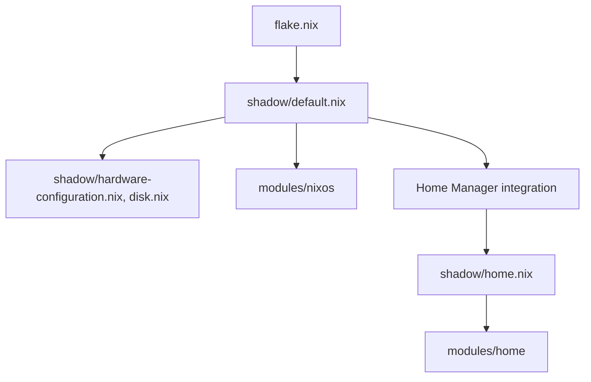

# Architecture

The repository separates machine facts and reusable modules. There is one
host and one user today, so `shadow/` holds both directly instead of going
through per-host and per-user subdirectories.



## Responsibilities

- `flake.nix` fixes shared host arguments and constructs the `nixosSystem`.
- `shadow/default.nix` owns hardware detection, disk layout, external module
  wiring, hostname, system state version, and selects the `modules/nixos`
  groups it needs (currently core, hardware, networking, security, storage,
  services, desktop, and gaming).
- `modules/nixos` provide focused system capabilities grouped by domain. Each
  domain's `default.nix` aggregates that domain's files.
- `shadow/home.nix` owns Aqua's identity, state version, session variables,
  runtime `nix.conf` link, and selects the `modules/home` groups it needs.
- `modules/home` own individual programs, shell tools, and desktop components,
  grouped by domain the same way as `modules/nixos`.

NixOS modules do not import Home Manager user modules. Reusable modules receive
`username` through module arguments or use `config.home.homeDirectory` instead
of embedding Aqua's identity. Literal Aqua paths remain in Noctalia's tracked
TOML template. sops-nix renders its credential-bearing runtime copy into tmpfs
without placing plaintext in the Nix store.

## Layout

```text
shadow/                 machine + user composition for the shadow host
shadow/default.nix       NixOS composition, hardware wiring, module selection
shadow/hardware-configuration.nix  generated hardware facts
shadow/disk.nix          Disko layout
shadow/home.nix           Aqua's Home Manager composition
modules/nixos/core/    boot, locale, Nix, packages, and users
modules/nixos/hardware hardware capabilities and peripherals
modules/nixos/desktop/ Niri, greetd/tuigreet, GTK applications, and fonts
modules/nixos/networking/ DNSCrypt, firewall, and NetworkManager
modules/nixos/security/ active baseline plus documentation
modules/nixos/storage/ preservation plus future-work documentation
modules/nixos/services/ focused system services and Flatpak
modules/nixos/gaming/  standard Steam, Proton, and GameMode configuration
modules/home/desktop/  desktop integration (GTK, XDG, bookmarks, web apps)
modules/home/programs/ configured programs (ghostty, librewolf, keepassxc, zed)
modules/home/packages/ plain package lists (CLI tools, dev tools, standalone apps)
modules/home/shell/    fish and fastfetch
modules/home/wm/       Niri and Noctalia
assets/                future shared assets; owned assets stay with modules
encrypted-secrets/     committed SOPS ciphertext only
secrets/               secret-management documentation only
docs/                  architecture, installation, persistence, security, roadmap
```

External NixOS modules are wired in one place: `shadow/default.nix`.
Module-specific KDL, TOML, SVG, and text assets stay beside the module that owns
them. Niri files are linked from `/saved/nixos-config`. Noctalia's tracked TOML
is a non-secret template rendered by sops-nix at activation.

## Adding a host or user

A second host would outgrow the flat `shadow/` layout. At that point, split
per-host facts into `hosts/<name>/` (hardware, disk, module selection) and
per-user Home Manager composition into `home/<user>/`, and reintroduce a
`profiles/` layer only if the hosts or users actually need to share a
different module mix. Don't add that structure before real duplication
exists — today `shadow/` is the only host and `aqua` is the only user.
