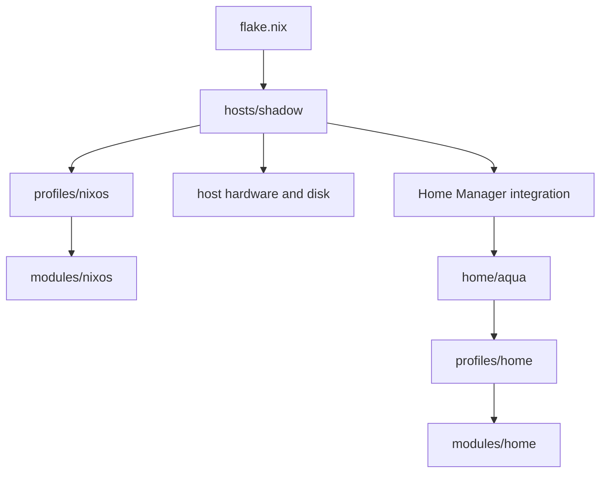

# Architecture

The repository separates machine facts, compositions, reusable NixOS modules,
and reusable Home Manager modules.



## Responsibilities

- `flake.nix` fixes shared host arguments and constructs each `nixosSystem`.
- `hosts/shadow` owns hardware detection, disk layout, external module wiring,
  hostname, system state version, and selected profiles.
- `profiles/nixos` compose reusable system capabilities. They are not NixOS
  specialisations; `shadow` currently selects baseline, desktop, and gaming.
- `modules/nixos` provide focused system capabilities grouped by domain.
- `home/aqua` owns Aqua's identity, state version, session variables, private
  out-of-store `nix.conf` link, and selected Home profiles.
- `profiles/home` compose reusable Home Manager modules.
- `modules/home` own individual programs, shell tools, and desktop components.

NixOS modules do not import Home Manager user modules. Reusable modules receive
`username` through module arguments or use `config.home.homeDirectory` instead
of embedding Aqua's identity. Literal Aqua paths remain in Noctalia's external
TOML because that live-editable application file is not rendered by Nix.

## Layout

```text
hosts/shadow/          machine composition, hardware, and Disko layout
profiles/nixos/        baseline, desktop, and gaming compositions
profiles/home/         shell, desktop, and development compositions
modules/nixos/core/    boot, locale, Nix, packages, and users
modules/nixos/hardware hardware capabilities and peripherals
modules/nixos/desktop/ Niri, greetd/ReGreet, GNOME, and fonts
modules/nixos/networking/ DNSCrypt, firewall, and NetworkManager
modules/nixos/security/ active baseline plus documentation
modules/nixos/storage/ preservation plus future-work documentation
modules/nixos/services/ focused system services and Flatpak
modules/nixos/gaming/  Jovian overlays/configuration and Steam
modules/home/          reusable desktop, program, shell, GNOME, and WM modules
home/aqua/             user identity and profile selection
assets/                future shared assets; owned assets stay with modules
secrets/               documentation only; no committed secrets
docs/                  architecture, installation, persistence, security, roadmap
```

External NixOS modules are wired in one place: `hosts/shadow/default.nix`.
Module-specific KDL, TOML, SVG, and text assets stay beside the module that owns
them. Niri and Noctalia files are linked from `/saved/nixos-config`, so this
repository path is part of the current runtime contract.

## Adding a host or user

Add a host directory containing its facts and profile selection, then add one
small `nixosConfigurations` entry or generalize the flake only when a second
host makes that useful. Add another user entry under `home/` and select Home
profiles there. Do not add a general host framework before real duplication
exists.
